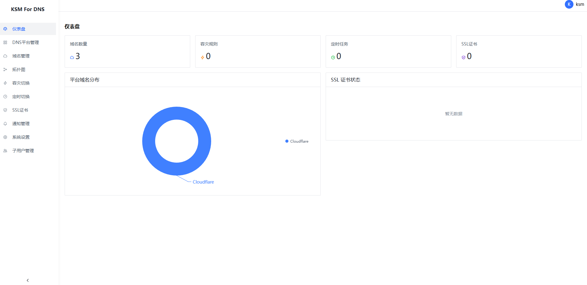

<p align="center">
  
  
</p>

<h1 align="center">KSM-DNS</h1>

<p align="center">Intelligent DNS & SSL Certificate Management Platform</p>

<p align="center">
  
  
  
  
</p>

<p align="center">
  <a href="README.md">中文</a> · <a href="us_readme.md">English</a>
</p>

---

> ⚠️ **Important Notice**  
> Portions of this project were generated with AI assistance and it is currently in an experimental phase. **Do NOT deploy to production environments.** The development team assumes no legal liability for any direct or indirect consequences arising from the use of this project.

---

## 📸 Screenshot

<p align="center">
  
</p>

---

## ✨ Features

- **Multi-Platform DNS** — Cloudflare, Alibaba Cloud DNS, Tencent DNSPod, Namesilo, Spaceship, Porkbun
- **DNS Record Management** — Full CRUD for A/AAAA/CNAME/MX/TXT/NS/SRV/CAA records with batch sync
- **One-Click DNS Migration** — Seamless cross-account, cross-platform DNS record migration
- **Domain Expiry Query** — Batch query domain expiration dates with auto-renewal toggle
- **Intelligent Failover** — Health checks (TCP/HTTP/HTTPS/Ping) + automatic backup record switching
- **Scheduled Tasks** — Cron-based scheduling for record modification, enabling, pausing
- **SSL Certificate Management** — ACME-based automatic issuance and renewal of Let's Encrypt certificates
- **Certificate Deployment** — SSH remote deployment with automatic service reload
- **Multi-User RBAC** — Admin + sub-users with per-domain read/write permissions
- **Notification Channels** — Email / Telegram / Web Push
- **PWA Support** — Installable to desktop with Web Push notifications
- **Hardened Security** — AES-256-GCM encryption at rest, SSH TOFU verification, login rate limiting, account lockout, password complexity policy

---

## 📦 Tech Stack

| Layer | Technology |
|-------|------------|
| **Backend** | Go 1.25 + Gin + GORM + SQLite + JWT + bcrypt + robfig/cron + ACME (Let's Encrypt) + SSH |
| **Frontend** | React 19 + TypeScript + Vite + Arco Design + Zustand + Axios + React Router + VChart |
| **Storage** | SQLite (`data/ksm.db`) + local file uploads |
| **Communication** | RESTful API + Web Push |

---

## 🚀 Quick Start

### Docker Compose Deployment (Recommended)

```bash
git clone https://github.com/KSM-Team/KSM-DNS.git
cd KSM-DNS
docker compose up -d
# Open http://localhost:8910
# Default: ksm / ksm2026
```

### Custom Admin Credentials

```bash
KSM_ADMIN_USER=myadmin KSM_ADMIN_PASSWORD=MyPass123! docker compose up -d
```

### Environment Variables

| Variable | Description | Default |
| --- | --- | --- |
| `KSM_ADMIN_USER` | Initial admin username | `ksm` |
| `KSM_ADMIN_PASSWORD` | Initial admin password | `ksm2026` |
| `KSM_JWT_SECRET` | JWT signing secret | Auto-generated |
| `KSM_PORT` | Backend port | `8910` |
| `KSM_DATA_DIR` | Data persistence directory | `/app/data` |
| `KSM_TLS_CERT` | TLS certificate path (optional) | — |
| `KSM_TLS_KEY` | TLS private key path (optional) | — |

### Data Persistence

The Docker volume `ksm-data` (mounted at `/app/data`) contains all persistent state:
- `ksm.db` — SQLite database
- `encryption_key` — AES-256 encryption key
- `jwt_secret` — JWT signing secret
- `uploads/` — Uploaded files

---

## 🛠️ Local Development

### Prerequisites

- Go 1.25+
- Node.js 20+
- Docker (optional)

### Backend

```bash
cd backend
go mod download
go run .
# Backend starts on :8910
```

### Frontend

```bash
cd frontend
npm install
npm run dev
# Frontend starts on :5173, proxies API to :8910
```

---

## 📁 Project Structure

```
KSM-DNS/
├── backend/
│   ├── config/          # Configuration
│   ├── handlers/        # HTTP handlers
│   ├── middleware/       # JWT / CORS / Security / Rate limit / Password enforcement
│   ├── models/          # Data models + GORM encryption hooks
│   ├── services/
│   │   ├── crypto/      # AES-256-GCM encryption
│   │   ├── deploy/      # SSH certificate deployment
│   │   ├── dns/         # DNS provider adapters
│   │   ├── monitor/     # Health checks + failover
│   │   ├── notify/      # Notifications (Email / Telegram / WebPush)
│   │   ├── scheduler/   # Cron task scheduler
│   │   └── ssl/         # ACME certificate management
│   └── main.go
├── frontend/
│   ├── src/
│   │   ├── api/         # Axios HTTP client
│   │   ├── components/  # Shared components
│   │   ├── pages/
│   │   │   ├── dashboard/   # Dashboard
│   │   │   ├── domains/     # Domain / Expiry / Records
│   │   │   ├── migrate/     # DNS Migration
│   │   │   ├── platforms/   # DNS Platform Management
│   │   │   ├── failover/    # Failover & Recovery
│   │   │   ├── scheduler/   # Scheduled Tasks
│   │   │   ├── ssl/         # SSL Certificates
│   │   │   ├── notifications/ # Notification Management
│   │   │   ├── settings/    # System Settings
│   │   │   └── users/       # Sub-User Management
│   │   └── store/       # Zustand state management
│   └── vite.config.ts
├── Dockerfile
├── docker-compose.yml
├── README.md
└── us_readme.md
```

---

## 📄 License

[Apache-2.0](LICENSE)

---

<p align="center">
  <a href="https://github.com/KSM-Team/KSM-DNS">github.com/KSM-Team/KSM-DNS</a>
</p>